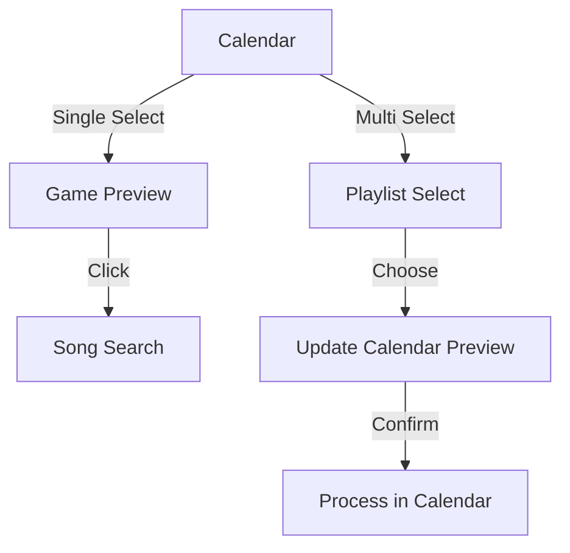

# Game Management System Implementation Plan

## Overview

A system to manage daily song-guessing games with both single and batch editing capabilities.

## Layout Structure
```
+----------------+------------------+
|                |                  |
|    Calendar    |   Game Preview   |
|    (with       |     OR          |
|   assignment   |   Song Search    |
|    states)     |                  |
|                |                  |
+----------------+------------------+
```

## Components

### Enhanced Calendar

Calendar days can have multiple states to represent different stages of game management:

```typescript
type CalendarDayState = {
  type: 'empty' | 'existing' | 'preview' | 'processing' | 'done' | 'error';
  game?: Game;
  previewSong?: SpotifyTrack;
  error?: string;
};
```

Visual States:
- Empty: Normal day
- Existing: Shows current song name
- Preview: Shows proposed song (dimmed/italic)
- Processing: Loading indicator
- Done: Checkmark + song name
- Error: Error indicator + song name

### Game Preview

Empty State (Entire component is clickable):
```
+--------------------------------+
|                                |
|        Click anywhere to       |
|        search for songs        |
|                                |
|  Title: _________________      |
|                                |
|  Artist: ________________      |
|                                |
|  Lyrics:                       |
|  _____________                 |
|  _____________                 |
|                                |
+--------------------------------+
```

Search Modal:
- Full-screen overlay
- Search input
- Results list with preview
- Selection updates game/preview

## Implementation

### Phase 1: Base Components

Calendar Component:
```typescript
interface CalendarProps {
  mode: 'single' | 'batch';
  selectedDates: Date[];
  dayStates: Record<string, CalendarDayState>;
  onDateSelect: (date: Date, multiSelect: boolean) => void;
}
```

Game Preview Component:
```typescript
interface GamePreviewProps {
  mode: 'view' | 'empty' | 'search';
  game?: Game;
  onSearchClick: () => void;
}
```

### Phase 2: Batch Mode Flow

User Flow:
1. Select Multiple Days
2. Select Playlist
3. Preview in Calendar
4. Process Changes

State Management:
```typescript
interface BatchState {
  selectedDates: Date[];
  selectedPlaylist?: SpotifyPlaylist;
  assignments: Record<string, {
    song: SpotifyTrack;
    state: 'preview' | 'processing' | 'done' | 'error';
  }>;
}
```

### Phase 3: Processing Logic

Sequential Processing:
```typescript
async function processBatch(assignments: BatchState['assignments']) {
  for (const [date, assignment] of Object.entries(assignments)) {
    try {
      updateAssignmentState(date, 'processing');
      await createOrUpdateGame(date, assignment.song);
      updateAssignmentState(date, 'done');
    } catch (error) {
      updateAssignmentState(date, 'error');
    }
  }
}
```

## Data Flow



## Component States

Calendar Day Styles:
```typescript
interface CalendarDayStyles {
  empty: 'text-muted',
  existing: 'text-foreground',
  preview: 'text-muted italic',
  processing: 'with-loader',
  done: 'text-success',
  error: 'text-error'
}
```

Game Preview States:
```typescript
type GamePreviewState = 
  | { mode: 'empty' }
  | { mode: 'view'; game: Game }
  | { mode: 'search' }
```

## API Integration

```typescript
interface GameAPI {
  // Single game operations
  createGame(date: string, song: SpotifyTrack): Promise<Game>;
  updateGame(date: string, song: SpotifyTrack): Promise<Game>;
  
  // Batch operations
  createGames(assignments: Array<{date: string; song: SpotifyTrack}>): Promise<void>;
}
```

## Implementation Order

1. Core Components
   - Enhanced calendar with states
   - Clickable game preview
   - Song search modal

2. Single Game Flow
   - Empty state interactions
   - Search and select
   - Game creation/update

3. Batch Mode
   - Multi-select in calendar
   - Playlist selection
   - Preview states in calendar
   - Sequential processing with visual feedback

4. Polish
   - Loading states
   - Error handling
   - Success indicators
   - Animations/transitions

## Types

```typescript
interface Game {
  id: string;
  date: string;
  song: {
    id: string;
    title: string;
    artist: string;
    lyrics: string;
  };
}

interface SpotifyTrack {
  id: string;
  name: string;
  artists: Array<{
    id: string;
    name: string;
  }>;
  preview_url?: string;
}

interface SpotifyPlaylist {
  id: string;
  name: string;
  tracks: {
    total: number;
  };
}
``` 