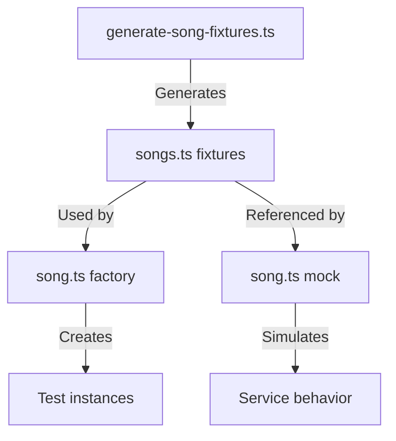
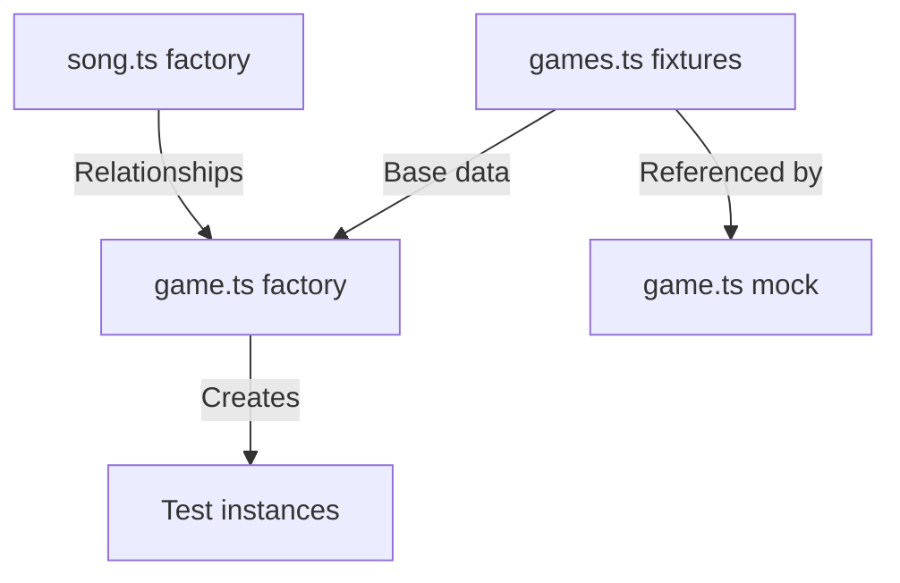

# Test Data Management Analysis

## Current Structure

### 1. Fixtures (`src/lib/test/fixtures/`)
- **Purpose**: Static, reusable test data
- **Generation**: Auto-generated from real APIs
- **Usage**: Base data for tests and mocks
- **Files**:
  ```
  fixtures/
  ├── songs.ts         # Auto-generated song data
  ├── guesses.ts       # Game guess scenarios
  ├── games.ts         # Game state data
  ├── spotify.ts       # Spotify API data
  ├── genius.ts        # Genius API data
  ├── dates.ts         # Consistent test dates
  └── responses/       # Raw API responses
  ```

### 2. Factories (`src/lib/test/factories/`)
- **Purpose**: Dynamic test data generation
- **Pattern**: Builder pattern with defaults
- **Features**: Customizable through overrides
- **Files**:
  ```
  factories/
  ├── song.ts    # Song instance creation
  ├── game.ts    # Game instance + relationships
  └── guess.ts   # Guess instance + game relation
  ```

### 3. Mocks (`src/lib/test/mocks/`)
- **Purpose**: Service behavior simulation
- **Pattern**: Jest mock functions + fixtures
- **Features**: Error cases, edge cases
- **Files**:
  ```
  mocks/
  ├── song.ts     # Song service simulation
  ├── spotify.ts  # Spotify API simulation
  ├── genius.ts   # Genius API simulation
  ├── game.ts     # Game service simulation
  └── prisma.ts   # Database simulation
  ```

## Data Flow Analysis

### 1. Song Data Flow


### 2. Game Data Flow


## Current Patterns

### 1. Data Definition
```typescript
// Fixture Pattern
export const PARTY_IN_THE_U_S_A_ = {
  spotifyId: "...",
  spotifyData: {...},
  lyrics: "...",
} as const;

// Factory Pattern
export const createMockSong = (overrides = {}) => ({
  id: "default",
  ...defaults,
  ...overrides
});

// Mock Pattern
class MockService {
  create = jest.fn().mockImplementation(
    () => fixtureData
  );
}
```

### 2. Relationship Handling
```typescript
// Factory with Relations
const createMockGame = (input = {}) => {
  const song = createMockSong();
  return {
    songId: song.id,
    song,
    ...input
  };
};

// Fixture with Relations
const GUESS_WITH_GAME = {
  game: GAME_FIXTURE,
  word: "test"
};
```

## Issues Identified

1. **Data Duplication**
   - Same structures defined multiple times
   - Inconsistent defaults across layers
   - Redundant relationship definitions

2. **Fixture Usage**
   - Factories don't use fixtures effectively
   - Mocks sometimes bypass factories
   - Inconsistent data sources

3. **Type Safety**
   - Incomplete type definitions
   - Inconsistent type usage
   - Missing validation

## Recommended Patterns

### 1. Base Fixture Pattern
```typescript
// fixtures/base/song.ts
export const baseSongFixture = {
  id: "base-song",
  title: "Test Song",
  artist: "Test Artist"
} as const;

// fixtures/songs.ts
import { baseSongFixture } from './base/song';

export const PARTY_IN_THE_U_S_A_ = {
  ...baseSongFixture,
  id: "party-usa",
  title: "Party in the U.S.A"
} as const;
```

### 2. Factory Using Fixtures
```typescript
// factories/song.ts
import { baseSongFixture } from '../fixtures/base/song';

export const createMockSong = (overrides = {}) => ({
  ...baseSongFixture,
  ...overrides
});
```

### 3. Mocks Using Factories
```typescript
// mocks/song.ts
import { createMockSong } from '../factories/song';

export class MockSongService {
  create = jest.fn().mockImplementation(
    () => createMockSong()
  );
}
```

## Implementation Plan

### 1. Immediate Changes
- Create base fixtures for each entity
- Update factories to use base fixtures
- Refactor mocks to use factories

### 2. Type System
```typescript
// types/fixtures.ts
export interface BaseFixture<T> {
  readonly id: string;
  readonly createdAt: Date;
  readonly updatedAt: Date;
}

export interface SongFixture extends BaseFixture<Song> {
  readonly title: string;
  readonly artist: string;
}
```

### 3. Validation
```typescript
// validation/fixtures.ts
export const validateSongFixture = (
  fixture: unknown
): fixture is SongFixture => {
  // Runtime type checking
};
```

## Migration Steps

1. **Phase 1: Structure**
   - Create `fixtures/base/` directory
   - Move common fixtures to base
   - Update imports

2. **Phase 2: Factories**
   - Update to use base fixtures
   - Add type validation
   - Improve documentation

3. **Phase 3: Mocks**
   - Refactor to use factories
   - Add error scenarios
   - Update tests

## Best Practices

1. **Data Definition**
   - Single source of truth in base fixtures
   - Type-safe overrides in factories
   - Validation at runtime

2. **Relationships**
   - Define in base fixtures
   - Maintain in factories
   - Validate in tests

3. **Testing**
   - Use factories in tests
   - Validate fixture usage
   - Check relationships 