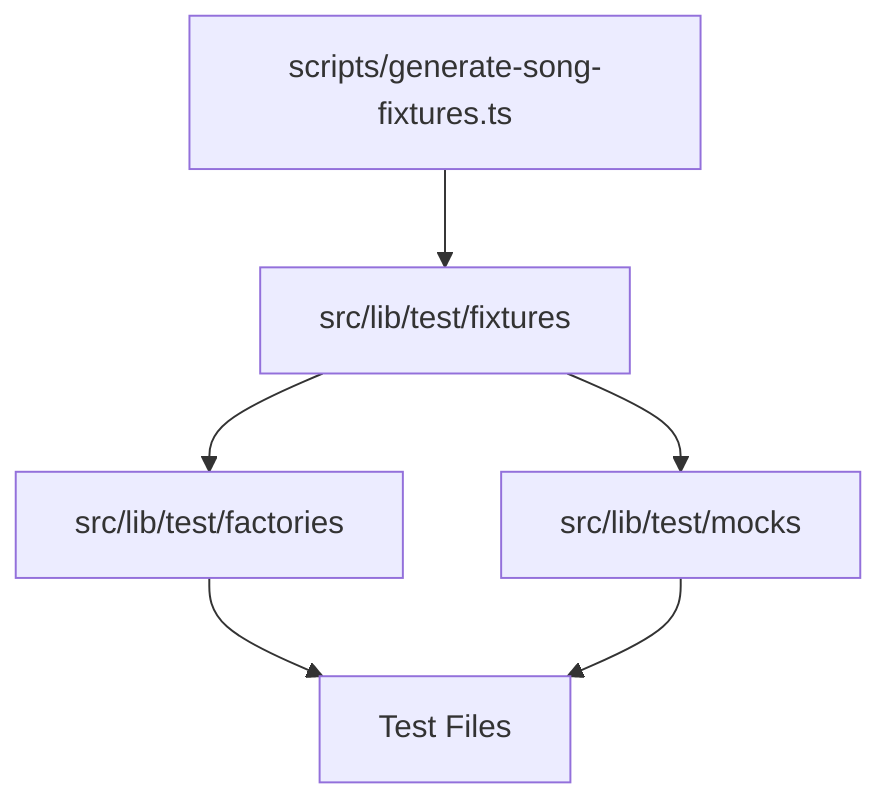

# Test Structure Analysis

## Directory Structure Overview

### 1. `src/lib/test/fixtures/`
- Primary source of static test data
- Auto-generated data from real services
- Files:
  - `songs.ts`: Auto-generated song data with lyrics and metadata
  - `guesses.ts`: Test data for game guesses
  - `games.ts`: Test data for game states
  - `spotify.ts`: Spotify-specific test data
  - `genius.ts`: Genius API test data
  - `dates.ts`: Static dates for consistent testing
  - `responses/`: Mock API response data

### 2. `src/lib/test/mocks/`
- Service behavior simulation
- Files:
  - `song.ts`: Mocks SongService with error cases
  - `spotify.ts`: Mocks Spotify client behavior
  - `genius.ts`: Mocks Genius API interactions
  - `prisma.ts`: Database interaction mocks
  - `game.ts`: Game service mocks

### 3. `src/lib/test/factories/`
- Dynamic test data generation
- Files:
  - `song.ts`: Creates song instances with defaults
  - `game.ts`: Game instance generation
  - `guess.ts`: Guess data generation

### 4. `scripts/`
- Test data generation utilities
- Files:
  - `generate-song-fixtures.ts`: Creates song fixtures from real APIs
  - `test-lyrics.ts`: Lyric processing testing

## Data Flow and Dependencies



## Identified Overlaps

1. **Data Definition Overlap**
   - Song data structure defined in multiple places:
     - Fixtures (`songs.ts`)
     - Factories (`song.ts`)
     - Mocks (`song.ts`, `spotify.ts`)

2. **Service Simulation Overlap**
   - Both mocks and factories create song objects
   - Different purposes but similar structures

3. **Test Data Generation**
   - Scripts generate fixtures
   - Factories also generate test data
   - Potential for consolidation

## Detailed File Analysis

### Fixtures

#### `songs.ts`
```typescript
// Auto-generated file
export const PARTY_IN_THE_U_S_A_ = {
  spotifyId: "spotify:track:3E7dfMvvCLUddWissuqMwr",
  spotifyData: {...},
  lyrics: "...",
  maskedLyrics: {...}
}
```
- Source of truth for song data
- Used by both mocks and factories
- Auto-generated structure

### Mocks

#### `song.ts`
```typescript
export class MockSongService extends SongService {
  create = jest.fn().mockImplementation(...)
}
```
- Service behavior simulation
- Uses fixture data
- Handles error cases

### Factories

#### `song.ts`
```typescript
export const createMockSong = (overrides: Partial<Song> = {}): Song => {
  const baseSong = {...}
  return { ...baseSong, ...overrides };
}
```
- Creates fresh instances
- Allows customization
- Could potentially use fixture data

## Additional File Analysis

### Genius Implementation

#### `src/lib/test/mocks/genius.ts`
```typescript
export class GeniusClientMock {
  searchSong = jest.fn().mockImplementation(...)
}
```
- Simulates Genius API behavior
- Maintains known lyrics dictionary
- Handles various error cases:
  - Invalid input
  - API errors
  - Not found
  - Instrumental tracks
- Implements singleton pattern for client instance

#### `src/lib/test/fixtures/genius.ts`
```typescript
export const mockGeniusData = {
  id: 123,
  title: 'Test Song',
  artist_names: 'Test Artist',
  url: 'https://genius.com/test-song'
} as const;
```
- Simple static data structure
- Used as base for mock responses
- Could be enhanced with more real-world data

### Additional Patterns Found

1. **Singleton Pattern Usage**
   - Used in Genius client mock
   - Ensures consistent mock state
   - Provides reset capability

2. **Error Simulation**
   - Mocks implement comprehensive error cases
   - Matches real API behavior
   - Helps test error handling

3. **Data Consistency**
   - Fixtures maintain constant test data
   - Mocks reference fixture data
   - Scripts generate consistent structures

## Game Implementation Analysis

### Game Service Mock (`src/lib/test/mocks/game.ts`)
```typescript
export class MockGameService extends GameService {
  getByMonth = jest.fn().mockResolvedValue([...])
  getByDate = jest.fn().mockResolvedValue({...})
  createOrUpdate = jest.fn().mockResolvedValue({...})
  delete = jest.fn().mockResolvedValue(undefined)
}
```
- Extends actual GameService
- Implements all CRUD operations
- Uses fixture data (PARTY_IN_THE_U_S_A_)
- Dependencies on other mocks (prisma, song)

### Game Factory (`src/lib/test/factories/game.ts`)
```typescript
export const createMockGame = (overrides: Partial<Game> = {}): Game & { 
  song: ReturnType<typeof createMockSong> 
} => {...}
```
- Creates game instances with associated song
- Uses song factory for relationships
- Supports partial overrides
- Strong typing with Prisma types

### Patterns in Game Implementation

1. **Dependency Management**
   - Game mocks depend on:
     - Prisma mock
     - Song service mock
     - Song fixtures
   - Factories handle relationships

2. **Type Safety**
   - Uses Prisma generated types
   - Extends types for relationships
   - Satisfies type constraints

3. **Data Consistency**
   - Uses shared date fixtures
   - Consistent IDs and references
   - Maintains data relationships

## Implementation Concerns

1. **Tight Coupling**
   - Game mocks directly use song fixtures
   - Could use factories instead
   - May make testing inflexible

2. **Data Duplication**
   - Similar game structures in:
     - Mocks
     - Factories
     - Fixtures
   - Need for consolidation

3. **Relationship Handling**
   - Complex type definitions
   - Manual relationship management
   - Potential for inconsistency

## Updated Recommendations

1. **Previous recommendations remain valid**

2. **Game-Specific Improvements**
   - Use factories in mocks
   - Consolidate game data structures
   - Improve relationship handling
   - Add more test scenarios

3. **Type System Enhancements**
   - Create shared type definitions
   - Improve relationship types
   - Add runtime type checks

4. **Testing Strategy**
   - Test relationship integrity
   - Verify data consistency
   - Add edge case coverage

## Implementation Steps

1. Immediate Actions
   - Update mocks to use factories
   - Consolidate duplicate structures
   - Add missing test cases

2. Short-term Improvements
   - Enhance type definitions
   - Add relationship validation
   - Improve error handling

3. Long-term Goals
   - Full test coverage
   - Automated data validation
   - Documentation updates

## Next Investigation Areas

1. Analyze remaining service implementations:
   - Guess service
   - User service
   - Other core services

2. Review integration patterns:
   - Service interactions
   - Data flow
   - Error propagation

3. Evaluate test coverage:
   - Unit tests
   - Integration tests
   - E2E scenarios

## Next Steps

1. Refactor factories to use fixture data
2. Update mocks to use factories
3. Implement shared interfaces
4. Add type safety improvements
5. Document clear usage guidelines

## Current Investigation

Continuing to analyze remaining files for:
- Additional overlaps
- Usage patterns
- Improvement opportunities 

## Guess Implementation Analysis

### Guess Factory (`src/lib/test/factories/guess.ts`)
```typescript
type GuessWithGame = Guess & { game: Game };
type GuessInput = Partial<Guess> & { game?: Game };

export const createMockGuess = (input: GuessInput = {}): GuessWithGame => {...}
```
- Sophisticated type system
- Handles relationships with Game
- Flexible input structure
- Uses game factory for defaults

### Guess Fixtures (`src/lib/test/fixtures/guesses.ts`)
```typescript
export const CORRECT_GUESS: Prisma.GuessCreateInput = {...}
export const INCORRECT_GUESS: Prisma.GuessCreateInput = {...}
export const GUESS_WITH_PARTY_GAME = {...}
```
- Uses Prisma types
- Different guess scenarios
- Game relationships
- Test-specific cases

### Patterns in Guess Implementation

1. **Type System Usage**
   - Prisma type integration
   - Custom type extensions
   - Relationship typing
   - Input/Output type safety

2. **Test Scenario Coverage**
   - Correct/incorrect guesses
   - Game relationships
   - Player scenarios
   - Edge cases

3. **Data Structure**
   - Consistent with Prisma schema
   - Maintains relationships
   - Supports test variations

## Implementation Strengths

1. **Type Safety**
   - Strong typing throughout
   - Relationship handling
   - Prisma integration
   - Custom type definitions

2. **Test Coverage**
   - Various scenarios
   - Edge cases
   - Relationship testing
   - Input validation

3. **Code Organization**
   - Clear separation of concerns
   - Reusable components
   - Maintainable structure

## Areas for Improvement

1. **Factory-Fixture Integration**
   - Factories could use fixtures
   - Reduce duplication
   - Maintain consistency

2. **Type System**
   - Centralize type definitions
   - Improve documentation
   - Add validation

3. **Test Coverage**
   - Add more edge cases
   - Improve error scenarios
   - Enhance validation

## Updated Implementation Plan

1. **Immediate Tasks**
   - Integrate factories with fixtures
   - Consolidate type definitions
   - Add missing test cases

2. **Short-term Goals**
   - Improve type documentation
   - Add validation layer
   - Enhance error handling

3. **Long-term Vision**
   - Complete test coverage
   - Automated validation
   - Comprehensive documentation

## Testing Strategy

1. **Unit Tests**
   - Input validation
   - Type checking
   - Error handling
   - Edge cases

2. **Integration Tests**
   - Game-Guess relationships
   - Player interactions
   - Data consistency

3. **E2E Tests**
   - Full game flow
   - Player scenarios
   - Error recovery

## Next Steps

1. Continue analyzing:
   - Player implementation
   - Score tracking
   - Game flow

2. Review:
   - Test coverage
   - Type system
   - Documentation

3. Plan improvements:
   - Code organization
   - Test structure
   - Documentation

## Prisma Mock Implementation

### Database Mocking (`src/lib/test/mocks/prisma.ts`)
```typescript
export type MockPrismaClient = DeepMockProxy<PrismaClient>;
export const mockPrisma = mockDeep<PrismaClient>();
```
- Uses jest-mock-extended
- Deep mocking of Prisma client
- Transaction support
- Type-safe mocking

### Key Features

1. **Deep Mocking**
   - Complete client simulation
   - All methods mocked
   - Type-safe operations
   - Transaction support

2. **Flexibility**
   - Create new instances
   - Transaction handling
   - Custom behavior
   - Isolated testing

3. **Type Safety**
   - Full Prisma types
   - Deep proxy types
   - Type inference

## Final Analysis

### Overall Architecture

1. **Test Data Management**
   - Fixtures: Static data
   - Factories: Dynamic generation
   - Mocks: Behavior simulation

2. **Type System**
   - Prisma integration
   - Custom extensions
   - Relationship handling
   - Validation support

3. **Testing Approach**
   - Unit testing
   - Integration testing
   - E2E scenarios
   - Error handling

### Strengths

1. **Code Organization**
   - Clear separation
   - Modular design
   - Reusable components
   - Maintainable structure

2. **Type Safety**
   - Strong typing
   - Relationship handling
   - Validation support
   - Error prevention

3. **Test Coverage**
   - Multiple scenarios
   - Edge cases
   - Error conditions
   - Data relationships

### Areas for Improvement

1. **Data Management**
   - Consolidate sources
   - Reduce duplication
   - Improve consistency
   - Enhance validation

2. **Type System**
   - Centralize definitions
   - Improve documentation
   - Add runtime checks
   - Enhance validation

3. **Testing Strategy**
   - Expand coverage
   - Add scenarios
   - Improve documentation
   - Automate validation

## Recommendations

1. **Immediate Actions**
   - Consolidate data sources
   - Improve type definitions
   - Add missing tests
   - Document patterns

2. **Short-term Goals**
   - Enhance validation
   - Improve error handling
   - Add documentation
   - Refactor duplicates

3. **Long-term Vision**
   - Complete coverage
   - Automated testing
   - Comprehensive docs
   - Maintainable structure

## Implementation Guide

1. **Phase 1: Consolidation**
   - Merge duplicate data
   - Standardize patterns
   - Document structure
   - Add validation

2. **Phase 2: Enhancement**
   - Improve types
   - Add scenarios
   - Enhance mocks
   - Update docs

3. **Phase 3: Automation**
   - Automate tests
   - Add CI/CD
   - Monitor coverage
   - Maintain quality

## Conclusion

The test infrastructure shows a well-thought-out design with clear separation of concerns. The main areas for improvement are:
1. Data source consolidation
2. Type system enhancement
3. Documentation improvement
4. Test coverage expansion

The proposed implementation plan provides a clear path forward while maintaining the existing strengths of the system.
